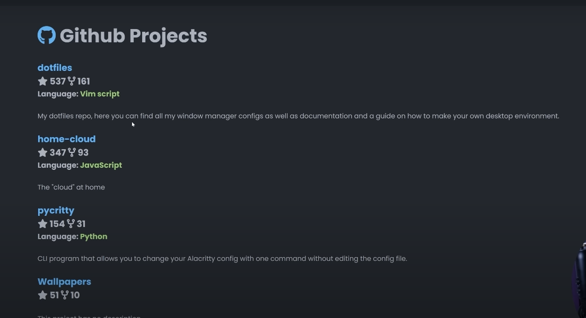

# **PORTAFOLIO**

font = Roboto mono para texto, Hack Nerd Font Mono para el menú

## **index de la página**

una buena idea es usar la API de github que nos permite visualizar los repositorios de mi página web.
Los datos salen de la base de datos personal y se actualiza con los datos de github.debemos hacer autenticación para poder acceder a nuestros datos y poder visualizarlos.

## **Requerimientos**

Project details: requerimiento para comentar una información previa de cada proyecto que hago.

## Instalar **dependencias**

Normalize.**css**

---

> [!CAUTION]
> Este repositorio se encuentra en desarrollo.

---

## **Características**

[ ] Implementar text truncate en la preview de la página cuando entregamos información previa del proyecto
[ ] Implementar texto o párrafos desde JavaScript
