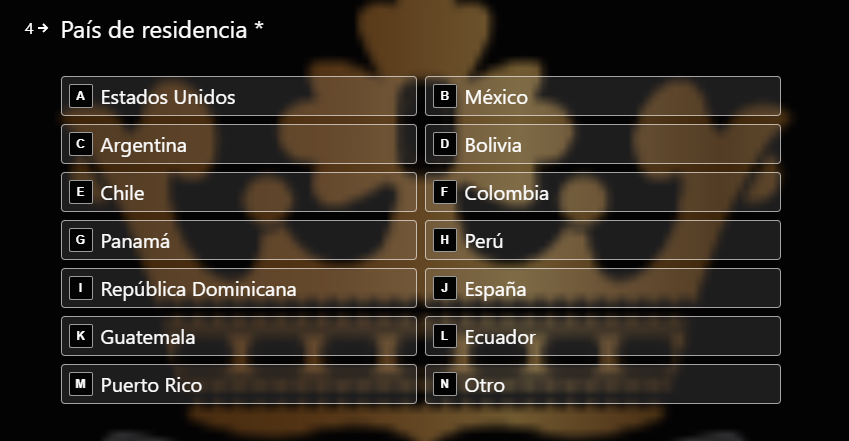
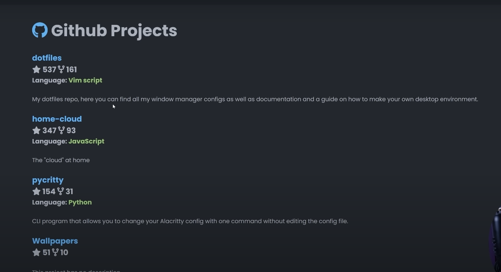

# portafolio

font = SF Mono

# requerimiento

linea de tiempo hacia abajo y que vaya mostrando la información en paralelo de todo https://smjurgenklaric.typeform.com/TF-InvPC-BL?utm_campaign=LotesPC&utm_source=Instagram&utm_medium=Social&utm_term=Typeform&utm_content=Generalista&typeform-source=l.instagram.commi aprendizaje, objetivos, que quiero y que no.

# formulario
En el formulario en caso de contacto intentaremos ponerlo de esta forma para que el usuario escriba los datos.

tener como guía uno de estos formularios
https://smjurgenklaric.typeform.com/TF-InvPC-BL?utm_campaign=LotesPC&utm_source=Instagram&utm_medium=Social&utm_term=Typeform&utm_content=Generalista&typeform-source=l.instagram.comhttps://smjurgenklaric.typeform.com/TF-InvPC-BL?utm_campaign=LotesPC&utm_source=Instagram&utm_medium=Social&utm_term=Typeform&utm_content=Generalista&typeform-source=l.instagram.com

# index de la página
una buena idea es usar la API de github que nos permite visualizar los repositorios de mi página web.
Los datos salen de la base de datos personal y se actualiza con los datos de github.debemos hacer autenticación para poder acceder a nuestros datos y poder visualizarlos.

# Requerimientos

Project details: requerimiento para comentar una información previa de cada proyecto que hago.